# PRACTICA 2 - GRUPO 2

## Integrantes

| Nombre | Carnet |
| --- | --- |
| José Manuel Ibarra Pirir | 202001800 |
| Roberto Carlos Gómez Donis | 202000544 |
| Angel Francisco Sique Santos | 202012039 |
----

## Descripción de la arquitectura

## Resumen de la arquitectura

**Componentes:**

* **Base de datos:** RDS (relacional o no relacional)
* **Servidor:** 1 servidor web (NodeJS) en una instancia EC2
* **Página web:** Alojada en un bucket S3 público
* **Almacenamiento de imágenes:** Bucket S3 con 2 carpetas (Fotos_Perfil y Fotos_Publicadas)
* **Inteligencia artificial:** Uso de Rekognition, Lex, Traslate.

**Funcionamiento:**

1. La página web recibe una solicitud del usuario.
2. El servidor web procesa la solicitud y consulta la base de datos.
3. El servidor web envía una respuesta al usuario.
4. Las imágenes se almacenan en el bucket S3 y se pueden acceder mediante una URL pública.

**Ventajas de esta arquitectura:**

* Escalabilidad: se pueden agregar más servidores web si es necesario.
* Seguridad: la contraseña del usuario se encripta y los grupos de seguridad se configuran para proteger las instancias EC2.
* Facilidad de uso: AWS proporciona herramientas para administrar todos los componentes de la arquitectura.

**Limitaciones de esta arquitectura:**

* Costo: AWS puede ser costoso, especialmente si se necesita una gran cantidad de recursos.
* Complejidad: la configuración y administración de la arquitectura puede ser compleja.

## Usuarios IAM

### RDS

Este grupo de acceso a un usuario para poder configurar la base de datos.

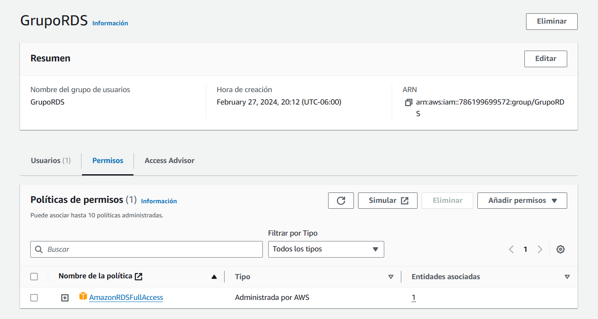
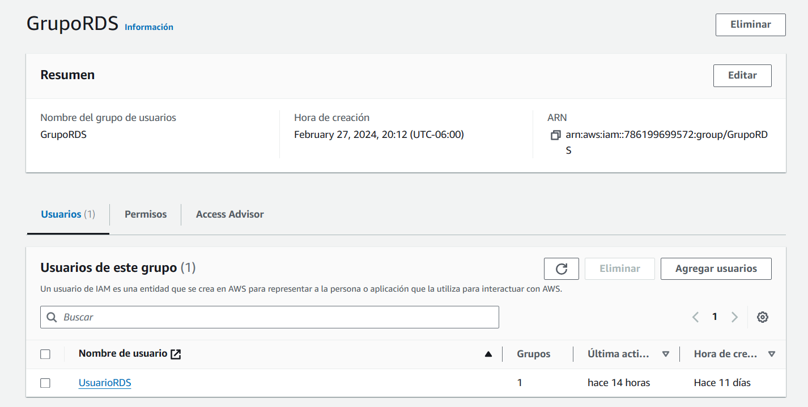

### EC2

Este se uso para crear las instancias y el balanceador de cargas

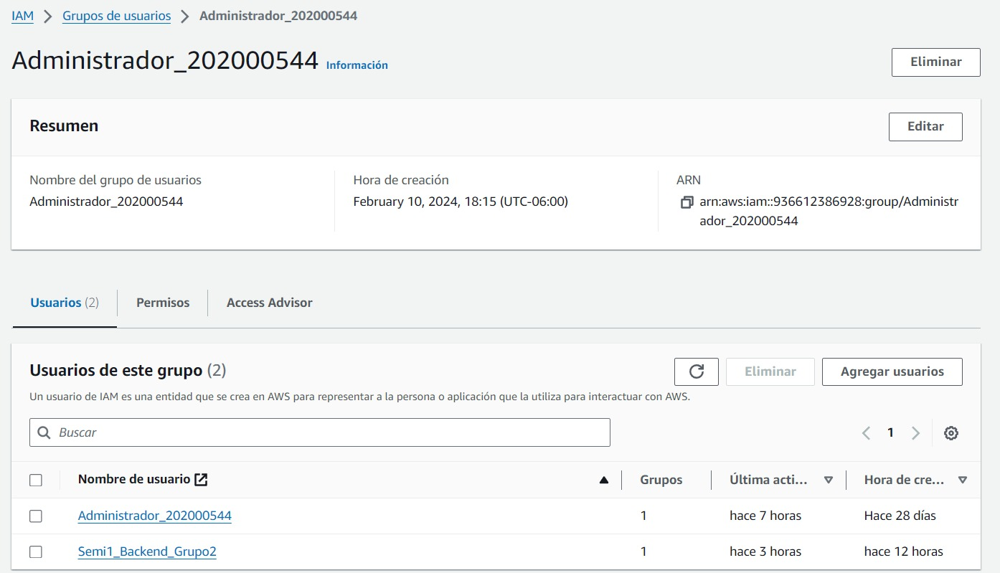
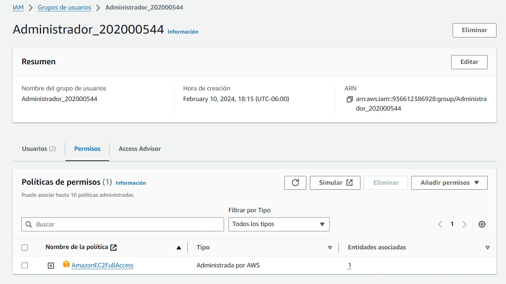

### S3 Página

Este usuario se uso para subir la página al S3

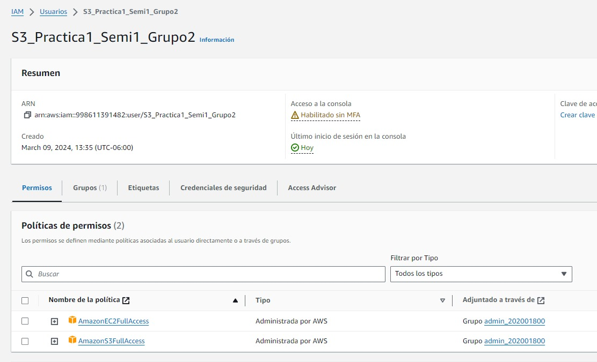
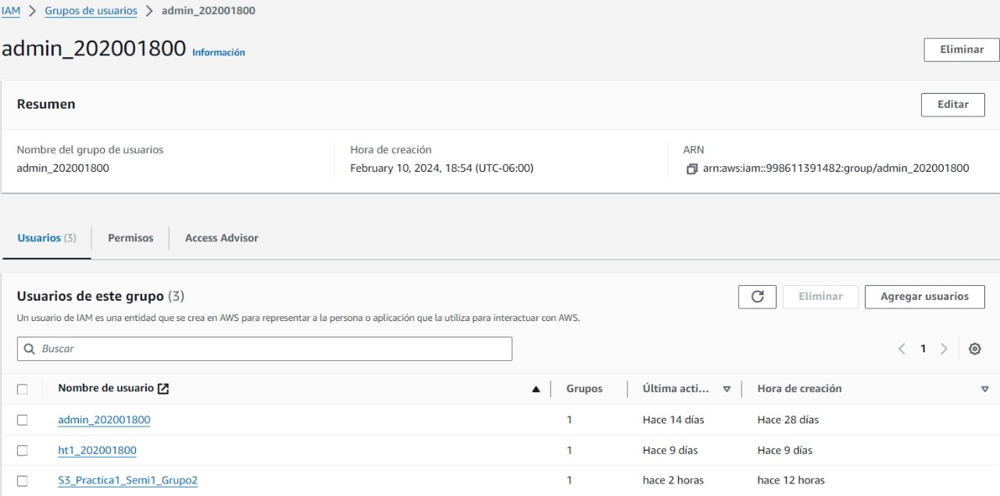

### S3 Imagenes

Este grupo y usuario se uso para crear el bucket para almacenar las imagenes

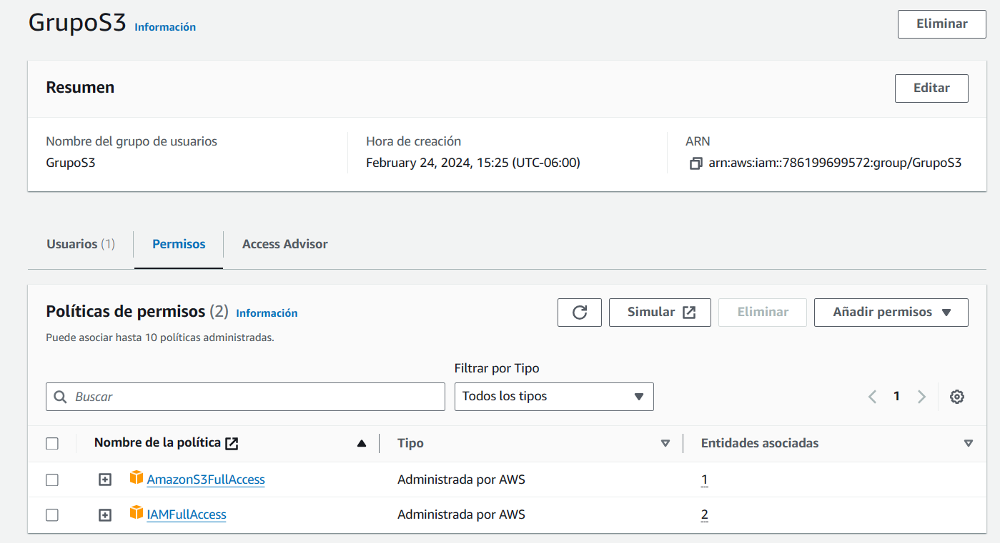
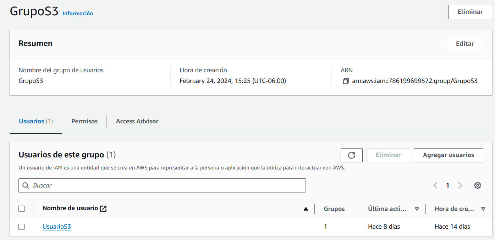

## Capturas de pantalla

### Página

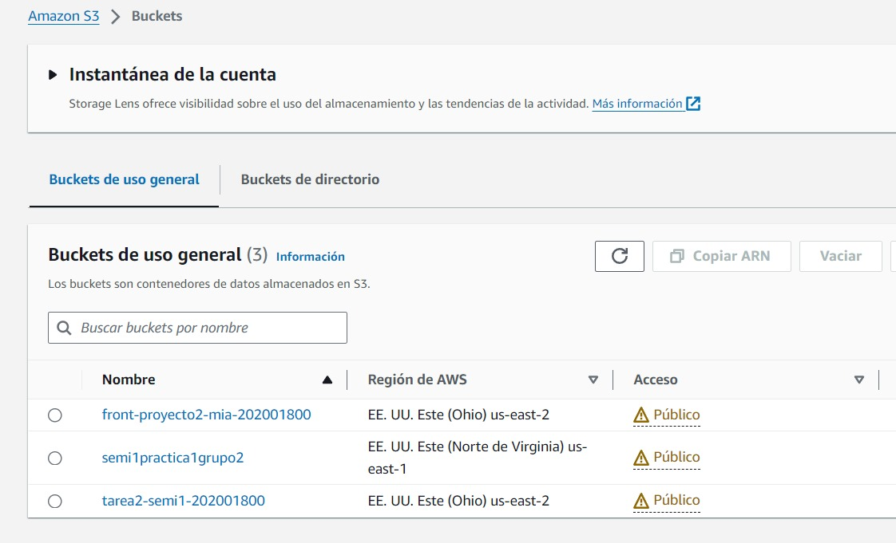

### EC2

#### Node

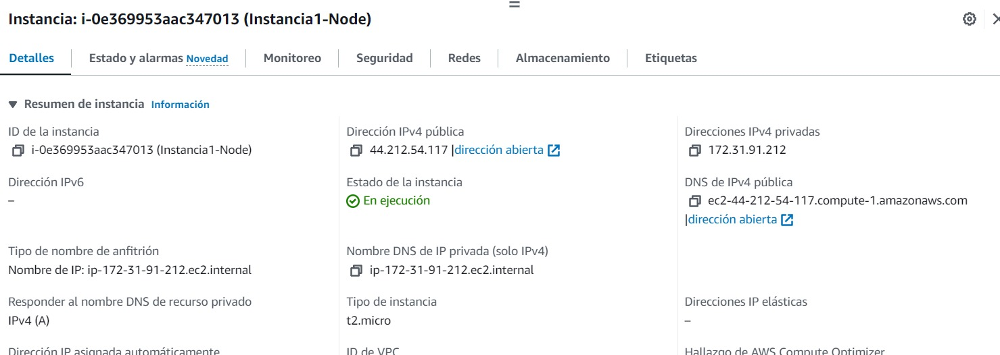

### Imágenes

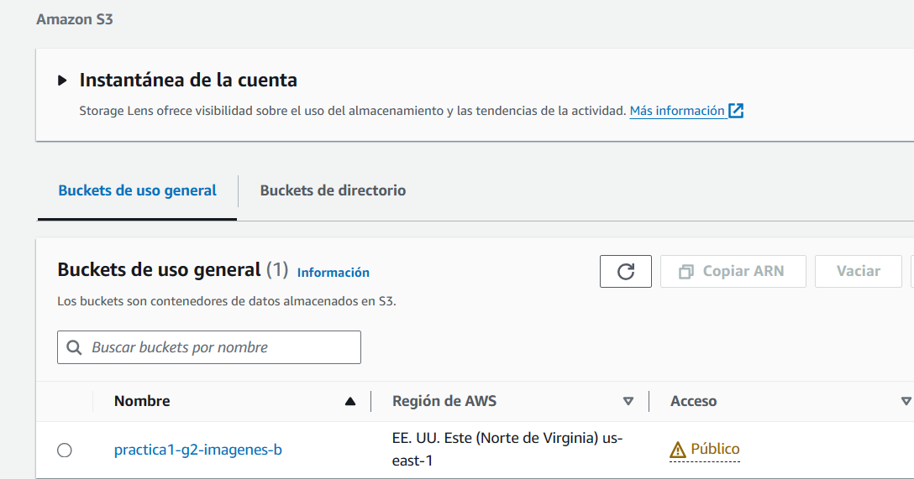

### Lex

## Funcionalidades Chatbot
### Descripción de animal
Se puede preguntar acerca de algunos animales para conseguir información sobre ellos. 

### Reservación al Museo de Historia Natural
Se puede hacer reservación de un cupo para entrar al museo nacional de Historia Natural. 

## Funcionalidades Amazon Rekognition
1. Se puede realizar login utilizando reconocimiento facial.
2. Al iniciar sesión se realiza un analisis aproximado de la persona, obteniendo datos como edad aproximada, sentimientos y accesorios puestos.
3. Al momento de subir una imagen se reconoce automaticamente el animal en la imagen y se crea un album en base a eso. 
4. Se puede extraer texto de imagenes que lo contengan. 