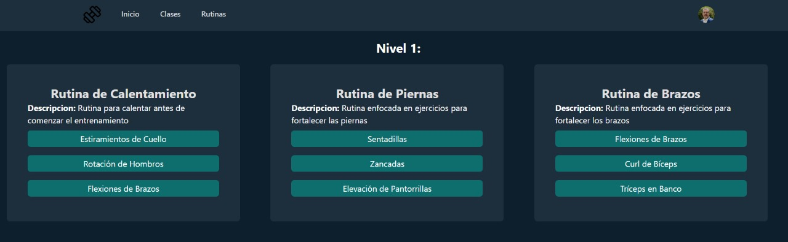

# Manual de Usuario

| Nombre                       | Carnet    |
| ---------------------------- | --------- |
| José Manuel Ibarra Pirir     | 202001800 |
| Angel Francisco Sique Santos | 202012039 |
| Roberto Carlos Gomez Donis   | 202000544 |

## Objetivos del Manual de Usuario

1. **Instrucciones Claras:** Proporcionar instrucciones fáciles de entender para usar el producto.
2. **Resolución de Problemas:** Ayudar a los usuarios a solucionar problemas comunes.
3. **Soporte:** Ofrecer información de contacto para obtener ayuda adicional.
4. **Feedback:** Invitar a los usuarios a proporcionar comentarios para mejorar el manual y el producto.
5. **Actualizaciones:** Mantener el manual actualizado con las últimas características y cambios del producto.

## Propuesta

### Funcionalidades clave

- **Autenticación Facial Segura:** Utilizamos la tecnología de reconocimiento facial y Cognito para garantizar la autenticación de los usuarios de manera segura y conveniente.

- **Gestión y Reserva de Clases:** Una vez autenticados, los usuarios pueden explorar, reservar y administrar fácilmente clases disponibles.

- **Notificaciones Automáticas:** Mantenemos a los usuarios informados con recordatorios automáticos sobre eventos importantes relacionados con sus clases utilizando AWS SNS.

- **Traducción y Escucha de Rutinas:** Nuestra aplicación ofrece la capacidad de traducir y escuchar rutinas relacionadas con las clases en varios idiomas para una mejor comprensión, gracias a Translate y Polly de AWS.

- **Búsqueda Avanzada:** Con nuestro sistema de búsqueda avanzada, los usuarios pueden encontrar clases por tipo de ejercicio, horario y entrenador. Además, pueden descubrir las clases más populares o recientes, clasificadas por un sistema de estrellas, utilizando tecnologías como EC2, RDS y API Gateway.

- **Chat Inteligente:** Nuestro chat interactivo utiliza Lex para recomendar y permite a los usuarios enviar mensajes con voz, aprovechando la funcionalidad de Transcribe.

Con nuestra aplicación, estamos transformando la forma en que las personas se comprometen con su salud y bienestar, brindando una experiencia de entrenamiento única y accesible para todos.

### Cómo usar la aplicación

### Funcionalidades de la Aplicación

1. **Login:**  
     
   Los usuarios pueden iniciar sesión en la aplicación ingresando sus credenciales.

2. **Registro:**  
     
   Los nuevos usuarios pueden registrarse para crear una cuenta en la plataforma.

3. **Página Principal:**  
     
   La página principal ofrece una visión general de las funcionalidades principales de la aplicación.

4. **Clases Disponibles:**  
     
   Los usuarios pueden explorar y reservar clases disponibles en esta sección.

5. **Ejercicio:**  
     
   Los usuarios pueden acceder a información detallada sobre los ejercicios incluidos en las clases.

6. **Editar Información:**  
     
   Los usuarios pueden editar su información personal en su perfil.

7. **Descripción ejercicio:**  
     
   Los usuarios pueden ver descripción de los ejercicios.

8. **Nivel:**  
     
   Los usuarios pueden ver su nivelactual.

9. **Asignar Nivel:**  
     
   Los administradores pueden asignar un nivel a los usuarios.

10. **Solicitar Nivel:**  
      
    Los usuarios pueden solicitar subir de nivel a un administrador.
