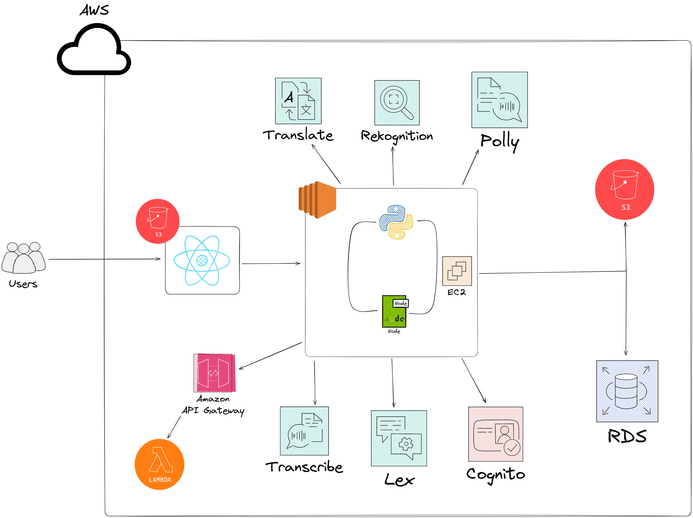
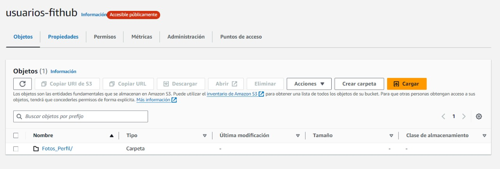
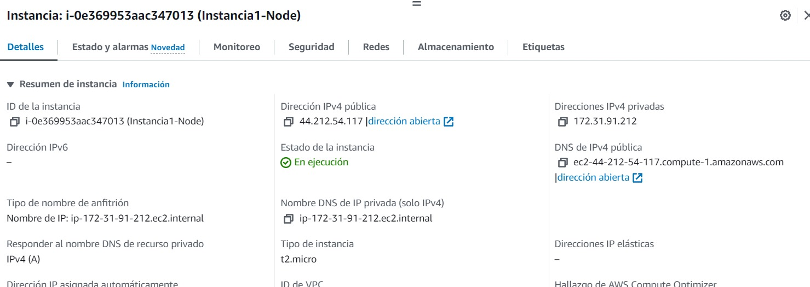
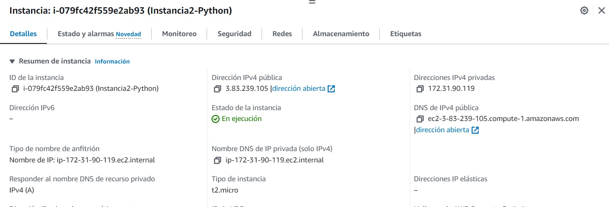
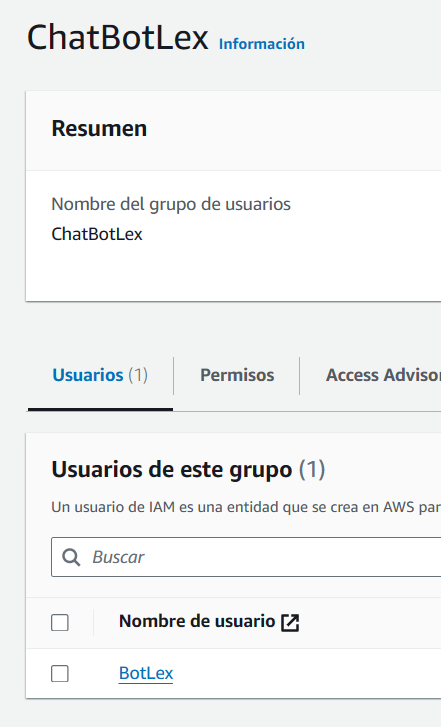
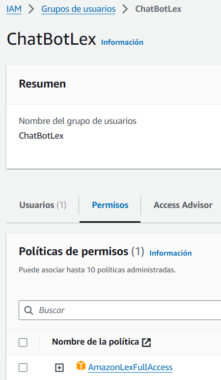

# PROYECTO FINAL - GRUPO 2

## Integrantes

| Nombre | Carnet |
| --- | --- |
| José Manuel Ibarra Pirir | 202001800 |
| Roberto Carlos Gómez Donis | 202000544 |
| Angel Francisco Sique Santos | 202012039 |
----

## Objetivos

### Objetivos Generales

*  Presentar casos de uso y ejemplos prácticos de cómo los servicios en la nube pueden utilizarse para abordar problemas del mundo real y mejorar la eficiencia operativa.

* Explorar y comprender los principios fundamentales de la computación en la nube y cómo estos afectan la implementación de servicios en la nube.

### Objetivos Especificos

* Proporcionar el diseño de una arquitectura escalable y resistente utilizando los servicios de AWS, como EC2, S3, RDS, etc.

* Incluir casos de estudio o ejemplos de empresas que han migrado con éxito a la nube, destacando los beneficios obtenidos y los desafíos superados.

## Descripción del proyecto

El proyecto propuesto es una plataforma de gestión de clases de ejercicios físicos que aprovecha las capacidades de la nube de AWS para ofrecer una experiencia completa y personalizada a los usuarios. A través de esta plataforma, los usuarios podrán acceder a una variedad de clases de ejercicios, reservar citas, recibir recordatorios automáticos y disfrutar de funciones avanzadas de búsqueda y recomendación.

### Caracteristicas principales:

* Inicio de Sesión Facial con Rekognition: Los usuarios pueden autenticarse de manera segura utilizando la autenticación facial proporcionada por Amazon Rekognition, lo que garantiza una experiencia de inicio de sesión fácil y segura.

* Gestión y Reserva de Clases: Una vez autenticados, los usuarios podrán explorar y reservar clases disponibles según sus preferencias de horario, tipo de ejercicio y entrenador.

* Notificaciones Automáticas: Los usuarios recibirán recordatorios automáticos sobre las clases reservadas, garantizando que no se pierdan ninguna sesión importante.

* Traducción y Escucha de Rutinas: La plataforma ofrecerá la capacidad de traducir y escuchar las rutinas relacionadas con las clases en diferentes idiomas, lo que facilita la comprensión y la participación para usuarios de diferentes regiones y culturas.

### Servicios de AWS utilizados

* Amazon Cognito: Para la autenticación segura de los usuarios. Es un servicio que nos proporciona autenticación, autorización y gestion de usuarios para servicios web.

* AWS Lambda: Para la gestión de las notificaciones automáticas y otras operaciones sin servidor. Un servicio de computacion sin servidor que permite ejecutar codigo en respuesta sin necesidad de aprovisionar servidores.

* Amazon Translate y Amazon Polly: Para la traducción y la conversión de texto a voz de las rutinas de ejercicio. proporciona traduccion automatica de texto entre diferentes idiomas.

* Amazon EC2, Amazon RDS y Amazon API Gateway: Para la implementación y gestión del sistema de búsqueda avanzada y clasificación de clases. Ofrece capacidad informatica escalable en la nube. Permite alamcenar datos en servidores virtuales.

* Amazon Lex y Amazon Transcribe: Para el chat con funcionalidad de voz y la transcripción de mensajes de voz a texto. Permite crear interfaces de conversacion (chatbots) utilizando tecnologia de procesamiento del lenguaje natural y aprendizaje automatico.

* Amazon SNS: Facilita la creación, envio y administracion de mensajes push y notificaciones por correo electronico y SMS a traves de diversos canales.

* Amazon RDS: Nos proporciona bases de datos relacionales gestionadas en la nube.

## Descripción de la arquitectura

## Resumen de la arquitectura

**Componentes:**
* **Base de datos:** RDS (relacional o no relacional)
* **Servidor:** 1 servidor web (NodeJS) en una instancia EC2
* **Página web:** Alojada en un bucket S3 público
* **Almacenamiento de imágenes:** Bucket S3 con una carpeta (Fotos_Perfil)
* **Inteligencia artificial:** Uso de Rekognition, Lex, Traslate.
* **Verificación de correo:** Verificación de que el correo utilizado sea verdadero.

**Funcionamiento:**

1. La página web recibe una solicitud del usuario.
2. El servidor web procesa la solicitud y consulta la base de datos.
3. El servidor web envía una respuesta al usuario.
4. Las imágenes se almacenan en el bucket S3 y se pueden acceder mediante una URL pública.

## Usuarios IAM

### RDS

Este grupo de acceso a un usuario para poder configurar la base de datos.

### EC2

Este se uso para crear las instancias y el balanceador de cargas

### S3 Página

Este usuario se uso para subir la página al S3

### S3 Imagenes

Este grupo y usuario se uso para crear el bucket para almacenar las imagenes

## Capturas de pantalla

### Página

### EC2

#### Node

### Lex

